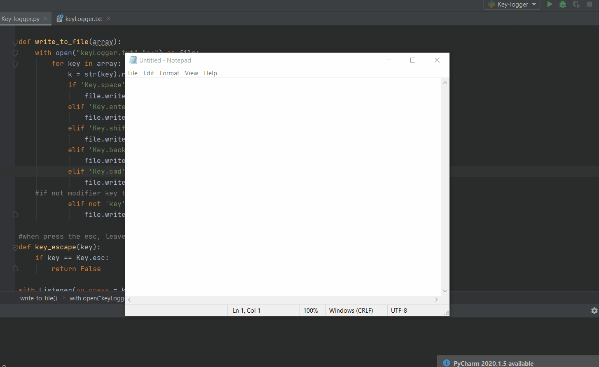

# Projects

**Python Keylogger**: 
### Copying the user key input and saving it to the file keyLogger.txt

https://github.com/fixus31/Projects/blob/main/Key-logger.py - automatic!
[GitHub](https://github.com/fixus31/Projects/blob/main/Key-logger.py)

